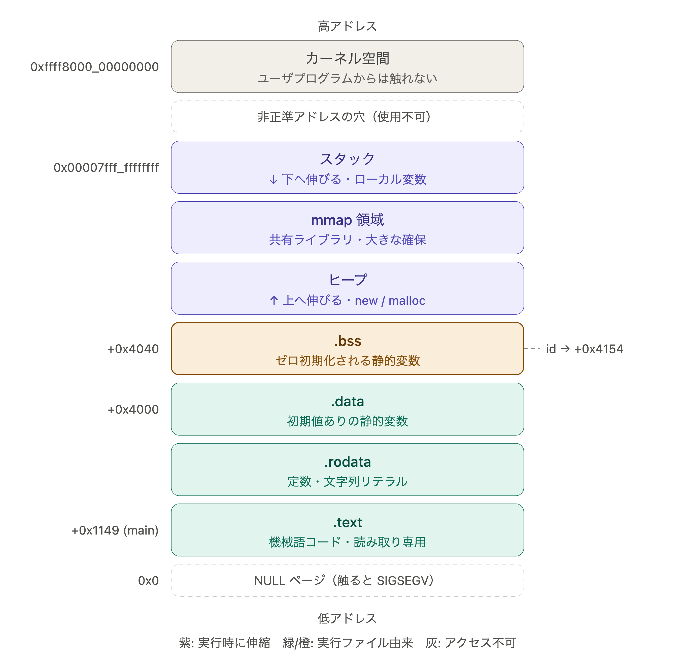

結果
```sh
$ g++ going-global.cpp -o p
$ ./p
0
```

本当に`.bss`に入るのか，objectファイルから実際に調べる


```sh
$ g++ -c going-global.cpp # objectファイルを作成
$ ls -lh go*
-rw-rw-r-- 1 naoto naoto   62  8月 15 23:06 going-global.cpp
-rw-rw-r-- 1 naoto naoto 2.4K  8月 15 23:09 going-global.o
$ objdump -t going-global.o |grep -w id
0000000000000000 g     O .bss   0000000000000004 id
```

- `0000000000000000`はシンボルの値．再配置可能なオブジェクト`.o`の場合はアドレスではなく所属セクション先頭からのオフセット
- `g`がflag で `g`ならグローバル
- `0`が変数の値

- `0000000000000004` はサイズで intの4byte
- `id`は変数名


```sh
$ objdump -d -M intel p | grep '<id>'
    1191:       8b 05 bd 2f 00 00       mov    eax,DWORD PTR [rip+0x2fbd]        # 4154 <id>
```
`# 4154 <id>`より，idは`.bss`の0x4154に配置される．

- 命令の長さは6byte(8b 05 bd 2f 00 00)
- x86_64のRIP相対は 次の命令アドレスが基準なので 基準は`0x1191 + 0x06 = 0x1197`
- `rip+0x2fbd`のアドレス値がidに入っている．`0x1197+0x2fbd = 0x4154`


x86-64アーキテクチャの仮想メモリ空間

</img>
